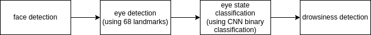
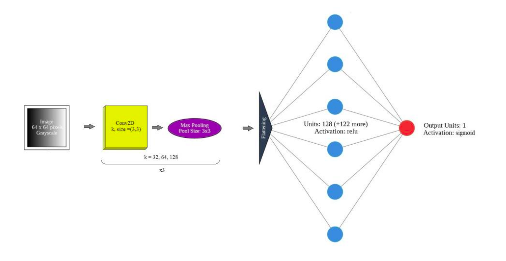

# Real-time Drowsiness Detection Using Dlid and CNN
---
## Install packages

Ubuntu

<pre>
$ wget http://dlib.net/files/shape_predictor_68_face_landmarks.dat.bz2
$ bzip2 -dk shape_predictor_68_face_landmarks.dat.bz2
$ rm shape_predictor_68_face_landmarks.dat.bz2
</pre>
* Install packages for dlib
<pre>
$ sudo apt-get install build-essential cmake
$ sudo apt-get install libgtk-3-dev
$ sudo apt-get install libboost-all-dev
</pre>

* Install prerequisites packages
<pre>
pip install -r requirements.txt
</pre>

## Run 

Ubuntu

<pre>
python3 drowsiness_cnn.py
</pre>
---

### CNN architecture:
Traning on [MRL Eye Dataset](http://mrl.cs.vsb.cz/eyedataset)

### Demo
